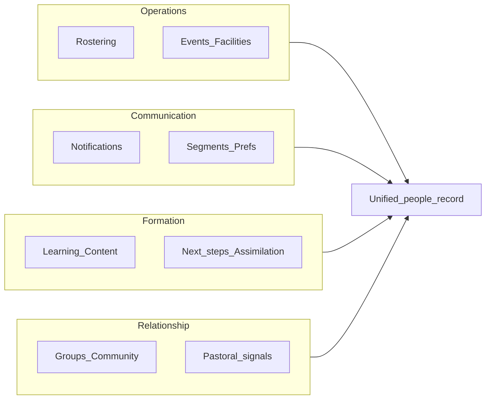

# Church operational struggles: research synthesis

This is **desk research** from ministry-tech blogs, ChMS vendors, and church leadership sources-not a survey of your congregation. Use it to **prioritize problems**, then validate with local pastors, admins, and volunteers before building.

---

## Cross-cutting themes (big and small)

**Fragmented tools and duplicate work**  
Many churches stitch together **5-7+ systems** (giving, ChMS, website, email/SMS, events, volunteer scheduling, accounting). Data does not flow between them, so staff **re-enter the same people and events**, reconcile mismatches, and lose a **single view of someone's engagement** (giving vs groups vs serving). Sources discussing this pattern include [Pushpay on disconnected church software](https://pushpay.com/blog/the-hidden-cost-of-disconnected-church-software/) and [church tech stack fragmentation](https://pushpay.com/blog/church-tech-stack-consolidation/).

**"Midsize church" squeeze**  
Churches with **enough complexity** to need multiple systems but **not enough staff** to run them feel this most: siloed data without dedicated ops roles to maintain integrations and workflows.

**Adoption beats features**  
Leaders often recognize technology's value, but **alignment with ministry goals** and **ease of use** (especially for volunteer admins) determine whether anything sticks. Simplicity and clear workflows matter as much as capability lists.

---

## Rostering and operations (volunteers, events, facilities)

| Struggle | What it looks like |
| --------------------------- | --------------------------------------------------------------------------------------------------------------------------------------- |
| **Last-minute gaps** | Cancellations and no-shows leave teams scrambling before services. |
| **Legacy coordination** | Spreadsheets, paper rotas, email chains-easy to **lose version of truth** and miss updates. |
| **Burnout and unfair load** | The same people get scheduled repeatedly; others never get asked, or **double-booking** across ministries when calendars are not shared. |
| **Weak comms** | People forget assignments; reminders that do not reach mobile habits fail. |

Industry write-ups on these patterns appear in guides such as [common volunteer scheduling problems](https://ministryschedulerpro.com/blog/5-common-volunteer-scheduling-problems-churches-face-and-how-to-solve-them) and [volunteer scheduling dos and don'ts](https://www.churchtrac.com/articles/dos-and-donts-of-church-volunteer-scheduling).

**Product implication:** Central **availability**, **fair rotation**, **swap/sub requests**, and **push/SMS-style reminders** address the operational pain; the **human** problem is trust and leadership culture, not only software.

---

## Notifying and communication

- **Channel overload:** Email, bulletin, WhatsApp, stage announcements-messages get missed; **urgent** vs **non-urgent** is not distinguished.
- **Personal vs scalable tension:** Broadcast blasts feel cold; **pastoral** communication wants a personal touch. Systems that support **segments** (e.g. newcomers, parents, volunteers) and **templates with personalization** help.
- **Mobile-first habits:** Schedules and last-minute changes need to meet people where they already look (phone).

**Product implication:** **Role-based and group-based messaging**, **preference centers** (what to receive and how), and **reliable delivery** (with audit/read receipts where appropriate) matter more than "another chat app."

---

## Learning, discipleship, and assimilation

- **Visitor / newcomer drop-off:** A large share of first-time guests do not return; **speed and quality of follow-up** (often in the first **24-72 hours**) and **clear next steps** (classes, meals, small groups) correlate with retention. Discussion of follow-up timing and mistakes appears in resources such as [Lifeway on guest follow-up](https://research.lifeway.com/2023/04/13/following-up-with-church-guests/) and commentary on [visitor retention](https://www.stylograph.ai/blog/church-visitor-retention-back-door-problem) (treat single statistics as directional, not gospel).
- **Generic onboarding:** Templated mail that feels mass-produced undermines relationship; churches need **workflows** that feel human.
- **Ongoing formation:** Tracking who is in **which course or group**, who dropped off, and who needs a nudge is hard without connected data.

**Product implication:** **Automated tasks for leaders** (e.g. "call this guest"), **content paths** (sermon notes, reading plans), and **visibility into steps completed**-without replacing pastoral judgment.

---

## Community and belonging

- **Finding a place:** New people do not know **how to join** groups or serving teams; information is scattered.
- **Pastoral blind spots:** Without a unified picture, leaders may not see **isolation** (stopped attending, stopped giving, stopped volunteering) until it is late.
- **Small church advantage:** Relationship often scales through **face-to-face** contact; apps should **support** that, not replace it.

**Product implication:** **Directory with privacy controls**, **small-group discovery**, **event RSVP**, and **lightweight "who is new / who needs care" signals** (with ethics and consent) align with real needs.

---

## Small church vs large church (useful contrasts)

| | **Smaller / resource-constrained** | **Larger / multi-site** |
| ------------------- | --------------------------------------------------------------------------------------------------------------------------------------------------------------------------------------------------------------------------------------------------------------------------------- | --------------------------------------------------------------------------------------------------- |
| **Budget & skills** | Few paid staff; tools must be **simple and cheap** to adopt. | More budget; higher **coordination** and **permissioning** needs. |
| **Tech stack** | Surveys have noted **gaps** in web and digital tooling vs larger congregations (see e.g. [Baptist Press on technology gaps](https://www.baptistpress.com/resource-library/news/study-technology-gap-emerging-between-large-small-churches/)); treat headline stats as indicative. | More **systems**, more **integration** pain; stronger need for **roles, approvals, and reporting**. |
| **Pastoral model** | High-touch, informal-**over-complex CRM** may fail. | More **process**, more **teams**, more **scheduling volume**. |

Practical guidance from practitioners often stresses **keeping stacks simple** for small churches (e.g. [Jay Kranda on tech by church size](https://www.jaykranda.com/blog/2024/11/15/tech-recommendations-for-small-medium-amp-large-churches))-relevant when you scope an MVP.

---

## How this maps to your listed areas

**Unified people and activity data** is the lever that reduces duplicate work and supports rostering, notifying, learning paths, and community-if you can keep **privacy, consent, and team boundaries** right.

---

## Suggested validation before you build

1. **Interview 5-10 people:** one senior leader, one admin, one volunteer coordinator, one small-group leader, one newcomer-about **last week's** friction (not hypothetical features).
2. **Pick one wedge:** e.g. "volunteer scheduling + reminders" OR "newcomer follow-up tasks" OR "group communication"-**one** deep workflow often beats five shallow tabs.
3. **Define church size and governance:** single congregation vs multi-site, and **who owns member data** (legal/privacy), to shape roles and hosting choices later.

---

## References (starting points)

- Volunteer scheduling challenges: [Ministry Scheduler Pro](https://ministryschedulerpro.com/blog/5-common-volunteer-scheduling-problems-churches-face-and-how-to-solve-them), [ChurchTrac](https://www.churchtrac.com/articles/dos-and-donts-of-church-volunteer-scheduling)
- Disconnected systems / stack: [Pushpay](https://pushpay.com/blog/the-hidden-cost-of-disconnected-church-software/)
- Small-church management and simplicity: [Church Member Pro](https://www.churchmemberpro.com/blog/small-church-management-tips/), [Jay Kranda](https://www.jaykranda.com/blog/2024/11/15/tech-recommendations-for-small-medium-amp-large-churches)
- Visitor follow-up: [Lifeway Research](https://research.lifeway.com/2023/04/13/following-up-with-church-guests/)
- Technology gap by size: [Baptist Press](https://www.baptistpress.com/resource-library/news/study-technology-gap-emerging-between-large-small-churches/)

---

When you move from research to **product scope**, the next decision is **which primary user** (attendee, volunteer, leader, staff) and **which single workflow** you want the first version to own end-to-end.
